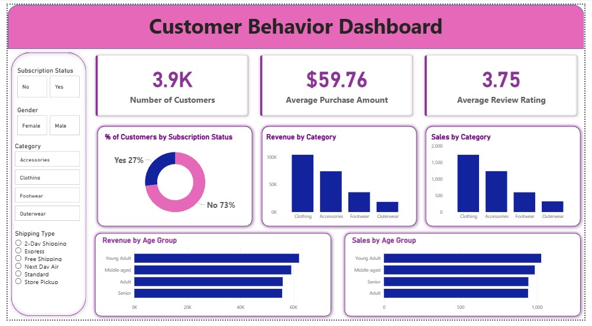

# 🛍️ Customer Shopping Behavior Analysis

This project performs an end-to-end analysis of a customer shopping dataset containing 3,900 transaction records. The goal is to uncover insights into spending patterns, customer segments, product preferences, and subscription behavior.

The workflow involves:
1.  **Data Cleaning & Feature Engineering** using **Python (Pandas)** in a Jupyter Notebook.
2.  **Data Storage & Analysis** using **PostgreSQL** to answer key business questions.
3.  **Data Visualization** using **Power BI** to create an interactive dashboard.
---

## 🛠️ Technologies Used

* **Data Cleaning:** Python (Pandas)
* **Database:** PostgreSQL
* **Python-to-SQL Connection:** `sqlalchemy` and `psycopg2`
* **Data Visualization:** Power BI
* **Environment:** Jupyter Notebook

---

## 🔁 Project Workflow

1.  **Data Preparation (Python)**
    * Loaded the `customer_shopping_behavior.csv` dataset into a pandas DataFrame.
    * Checked for missing values: Found 37 nulls in the `review_rating` column.
    * **Handled Missing Data:** Imputed the missing `review_rating` values using the **median** rating of that item's specific `category`.
    * **Standardized Columns:** Renamed all columns to `snake_case` for SQL compatibility (e.g., `Purchase Amount (USD)` became `purchase_amount`).

2.  **Feature Engineering (Python)**
    * `age_group`: Created a new categorical column by binning `age` into four quartiles: 'Young Adult', 'Adult', 'Middle-aged', and 'Senior'.
    * `purchase_frequency_days`: Mapped string values (e.g., 'Weekly', 'Fortnightly', 'Monthly') to their corresponding numerical day counts (e.g., 7, 14, 30).
    * **Redundancy Check:** Verified that `discount_applied` and `promo_code_used` were 100% identical and dropped the redundant `promo_code_used` column.

3.  **Database Loading (Python -> PostgreSQL)**
    * Established a connection to a PostgreSQL database (`customer_behavior`) using `sqlalchemy`.
    * Loaded the cleaned and transformed pandas DataFrame into a new SQL table named `customer`.

4.  **Data Analysis (SQL)**
    * Connected Power BI to the live PostgreSQL database.
    * All analyses and visualizations were built by querying the `customer` table directly.

---

## 📊 Key Analyses & Insights

10 key business questions were answered using SQL. Here are the main findings:

* **Revenue by Gender:** Male customers generated significantly more revenue ($157,890) than female customers ($75,191).
* **Top Rated Products:** The top 3 products by average review rating are **Gloves (3.86)**, **Sandals (3.84)**, and **Boots (3.82)**.
* **Subscription Status:**
    * **73%** of customers are **Non-Subscribers**.
    * Non-subscribers account for the vast majority of revenue ($170,436) compared to subscribers ($62,645).
    * Average spend is nearly identical between the two groups.
* **Shipping & Spend:** Customers using **Express** shipping have a slightly higher average purchase amount ($60.48) than those using **Standard** shipping ($58.46).
* **Discount-Dependent Products:** The products most frequently purchased with a discount are **Hat (50.0%)**, **Sneakers (49.7%)**, and **Coat (49.1%)**.
* **Customer Segmentation:** The customer base is heavily skewed towards repeat business:
    * **Loyal:** 3,116
    * **Returning:** 701
    * **New:** 83
* **Top Selling Items by Category:**
    * **Accessories:** Jewelry (171 orders)
    * **Clothing:** Blouse (171) & Pants (171)
    * **Footwear:** Sandals (160)
    * **Outerwear:** Jacket (163)
* **Revenue by Age Group:** The highest-spending age groups are **'Young Adult' ($62,143)** and **'Middle-aged' ($59,197)**.

---

## 📈 Business Recommendations

Based on the analysis, the following actions are recommended:

1.  **Boost Subscription Value:** With 73% of customers being non-subscribers, there is a massive opportunity for growth. Launch a marketing campaign to promote *exclusive* subscriber benefits, as average spending is already on par with non-subscribers.
2.  **Develop Loyalty Programs:** Target the 701 'Returning' customers with a new loyalty program to convert them into the 'Loyal' segment, which forms the core of the business.
3.  **Targeted Marketing:**
    * Focus marketing efforts on the **'Young Adult'** and **'Middle-aged'** demographics.
    * Promote top-selling items like **Jewelry, Blouses, and Jackets** in campaigns.
    * Highlight top-rated items like **Gloves and Sandals** to build trust.
4.  **Review Discount Strategy:** Investigate if the high 50% discount rate on 'Hat' and 'Sneakers' is profitable or simply eroding margins. Consider bundling these with full-price items instead.

---

## 🚀 How to Run This Project

1.  **Clone the repository:**
    ```bash
    git clone [https://github.com/your-username/your-repo-name.git](https://github.com/your-username/your-repo-name.git)
    ```
2.  **Install Python dependencies:**
    ```bash
    pip install pandas sqlalchemy psycopg2-binary
    ```
3.  **Set up PostgreSQL:**
    * Create a new PostgreSQL database (e.g., `customer_behavior`).
    * Update the database connection string in the `customer_behavior.ipynb` notebook with your username, password, and host.
4.  **Run the Notebook:**
    * Execute the cells in `customer_behavior.ipynb` to clean the data and populate your PostgreSQL database.
5.  **Visualize in Power BI:**
    * Open the `.pbix` file (if you include it in the repo).
    * Go to `Transform data` > `Data source settings` and update the credentials to point to your local PostgreSQL database.
    * Refresh the report to see the dashboard with the live data.
  
## 📊 Dashboard Preview  

Here’s a snapshot of the Power BI dashboard built in this project:  


